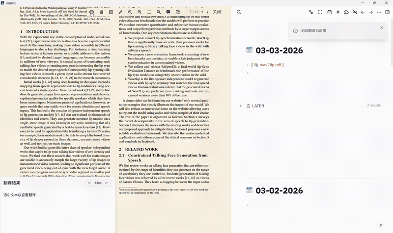
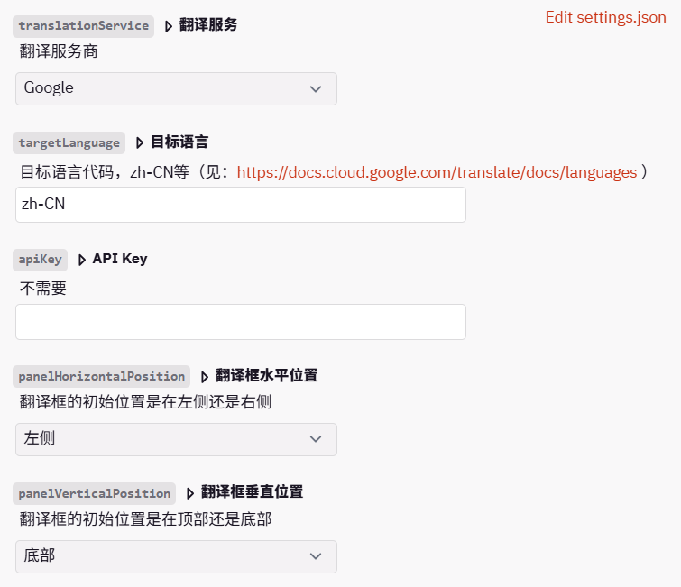

  

<h1 align="center"> logseq-pdf-translator </h1>

<h4 align="center"> A PDF mouse hover translator. </h4>

## Demo

## Install

## Settings

## Acknowledgments
- https://github.com/logseq/logseq
- https://github.com/logseq/logseq-plugin-samples
- https://github.com/pengx17/logseq-plugin-template-react
- https://github.com/windingwind/zotero-pdf-translate
